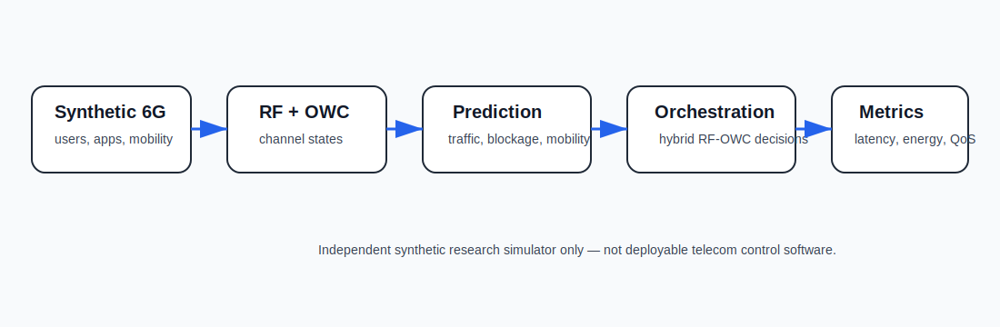
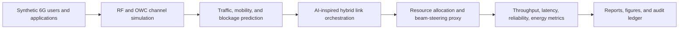

# Intelligent Hybrid RF-OWC 6G Network

<p align="center"><strong>Independent research-grade simulator for AI-driven hybrid radio-frequency and optical wireless communication networks, adaptive resource allocation, mobility-aware link orchestration, beam-steering proxies, cross-layer optimization, and photonic-enabled wireless systems.</strong></p>

<p align="center">
  <a href="../../actions/workflows/python-checks.yml"></a>
  <a href="LICENSE"></a>
  
  
</p>

> **Independent simulator boundary:** this repository uses fictional synthetic users, application traffic, mobility traces, RF channel states, optical wireless channel states, and photonic-efficiency proxies by default. It is an independent research simulator only. It is not telecom infrastructure control software, spectrum-management software, base-station firmware, deployable network equipment, or certified photonic integrated circuit design software.

---

## Research objective

Can AI-driven orchestration of hybrid RF and optical wireless communication links improve future 6G service delivery by dynamically balancing throughput, latency, reliability, mobility, blockage, beam steering, and energy efficiency according to application needs?

| Research question | Evidence generated locally |
| --- | --- |
| When should traffic use RF versus OWC? | Link decision table and policy rationale |
| Which policy best balances throughput, latency, reliability, and energy? | Policy comparison table |
| How do blockage and mobility affect optical wireless links? | Mobility and blockage summary |
| Can photonic efficiency improve hybrid wireless decisions? | Photonic-efficiency proxy in scheduling |
| Which applications are hardest to serve? | Application-quality report |
| Can experiments remain reproducible? | Hash-chained audit ledger |

---

## Architecture

<p align="center"></p>



---

## Run today — no real operator data needed

```bash
python scripts/run_synthetic_rf_owc_lab.py
```

Windows quick start:

```bat
cd %USERPROFILE%\intelligent-hybrid-rf-owc-6g-network
git pull

py -m venv .venv
.venv\Scripts\activate

python -m pip install --upgrade pip
python -m pip install -r requirements.txt
python scripts/run_synthetic_rf_owc_lab.py
```

Optional controls:

```bash
python scripts/run_synthetic_rf_owc_lab.py --users 96 --time-steps 144 --seed 42
```

---

## Generated local outputs

```text
outputs/results/synthetic_users.csv
outputs/results/synthetic_infrastructure.csv
outputs/results/synthetic_network_traces.csv
outputs/results/synthetic_link_states.csv
outputs/results/synthetic_predictions.csv
outputs/results/synthetic_link_decisions.csv
outputs/results/synthetic_policy_comparison.csv
outputs/results/synthetic_application_quality.csv
outputs/results/synthetic_mobility_blockage_summary.csv
outputs/results/synthetic_rf_owc_6g_summary.json
outputs/reports/synthetic_rf_owc_6g_report.md
outputs/audit/rf_owc_6g_audit_log.jsonl

outputs/figures/synthetic_service_satisfaction.png
outputs/figures/synthetic_latency_reliability.png
outputs/figures/synthetic_link_utilization.png
outputs/figures/synthetic_mobility_blockage.png
outputs/figures/synthetic_application_quality.png
```

---

## Orchestration policies included

| Policy | Purpose |
| --- | --- |
| `rf_only` | Coverage and mobility baseline |
| `owc_preferred` | Optical wireless capacity-first baseline |
| `latency_aware` | Selects links based on latency and reliability conditions |
| `energy_aware` | Uses OWC when photonic efficiency and blockage conditions are favorable |
| `adaptive_hybrid` | AI-inspired scheduler using demand, mobility, blockage, channel quality, and photonic-efficiency proxies |

---

## What the system evaluates

| Area | Examples |
| --- | --- |
| RF channel quality | RF interference, mobility impact, RF throughput and latency |
| OWC channel quality | Line-of-sight score, blockage probability, beam-alignment error |
| Prediction | Rolling traffic demand, mobility, and blockage prediction |
| Resource allocation | RF/OWC link selection and served throughput |
| Beam steering | Synthetic beam-alignment and steering-load proxy |
| Photonic integration | Synthetic photonic-efficiency gain proxy for OWC decisions |
| Service quality | Throughput, latency, reliability, handover rate, energy cost |
| Transparency | Decision rationale and hash-chained audit records |

---

## Independent research boundary

This project is an independent research simulator. Real-world use would require radio and optical hardware validation, channel measurements, regulatory review, operator integration, safety engineering, security review, photonic design validation, and expert oversight.

The system should never be used as the sole basis for spectrum control, public network operation, emergency communication routing, base-station behavior, access-point firmware, or safety-critical connectivity decisions.

---

## Repository map

```text
src/rfowc6g/
  synthetic.py       # fictional users, applications, mobility, traffic
  channels.py        # RF and OWC channel-state estimation
  prediction.py      # traffic, mobility, and blockage prediction features
  orchestration.py   # RF-only, OWC-preferred, latency, energy, adaptive policies
  metrics.py         # QoS, utilization, handover, energy metrics
  audit.py           # hash-chained audit ledger
  visualization.py   # local figures
  reporting.py       # Markdown experiment report
scripts/
  run_synthetic_rf_owc_lab.py
docs/
  methodology.md
  synthetic_lab.md
  independent_research_boundary.md
  report_template.md
tests/
  test_synthetic.py
  test_orchestration.py
  test_metrics.py
  test_pipeline.py
  test_audit.py
```

---

## Limitations

- Synthetic traces validate the pipeline but do not prove real-world network performance.
- The photonic-efficiency term is a transparent proxy, not a validated photonic circuit model.
- The adaptive scheduler is an interpretable research baseline, not production AI control logic.
- Real deployments require hardware, regulatory, security, and operator validation.
